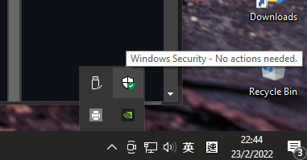
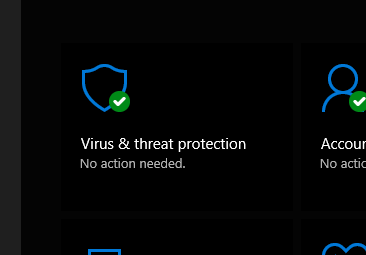
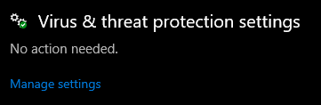
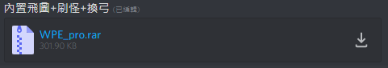
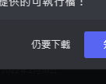
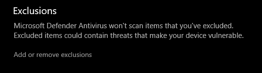
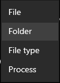
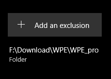

# 教學

## 下載: 
> ** (以下教學以 Win10 21H2 (HKG-ENG), Google Chorme, WinRAR 環境為例)
>
> 1. 關閉 win 內置防毒軟件
> (如有其他防毒，如何關閉請自行網上查詢)
> 
>     1.1 係 win 10 右下角 打開 "Windown Security" 
>     
>    
>     
>     1.2 Home Page > 㩒 "Virus & threat protection".
>     
>     
>     
>     1.3 㩒 "Virus & threat protection settings" > 將 "On" 全部改成 "OFF"
>     (部分人電腦會問你係咪確定要禁做，㩒 "確定/OK" 就得)
>     
>      
>           
>     
> 
> 2. 下載 "WPE_pro.rar"
> 
>     2.1 打開 "Discord" > 入 "連登吞2圍爐區" > 入 "WPE專區" Channel" > 㩒 "WPE_pro.rar" 文件下載 > 㩒 "仍要下戴"
> 
>      
>     
> 
>     2.2 係 "Google Chrome" 右下角 "Show More" / 㩒 "Download Page" > 㩒 "Keep dangerous file"
> 
>      
>     
> 
> 3. 解壓 "WPE_pro.rar"
> 
>     3.1 右Click "WPE_pro.rar" 文件 > 㩒 "Extract to WPE_pro.rar\"
> 
>     
>     
> 4. 加入白名單 & 開返 "Win 內置防毒"
> (如有其他防毒，如何啟動請自行網上查詢)
>
>     4.1 重複 1.1 - 1.2 步驟
> 
>     4.2 㩒 "Virus & threat protection settings" > 係 Exclusions 㩒 "Add or remove exclusions"
>     
>     
>     
>     4.3 㩒 "Add an exclusion" > 㩒 "Folder" > 搵返你 "WPE_pro" 存放位置 > 㩒 " Select Folder"
>     (以我為例: 我放左係F:\Download\WPE\WPE_pro)
>     
>     
>     
>     4.4 成功加入白名單後會見到禁嘅畫面
>     
>     
>     
>     4.5 翻返上一頁 "Virus & threat protection settings"
>     
>     4.6 將 "OFF" 全部改成 "ON"
>     
>           
>     
>     

## 基本使用:
> 
> 1. 開 "WPE_pro" 文件夾 > 右Click "wpe pro.exe" 用 "管理員身分運行"
> 
> 2. 打開 "Ts2 Online" 同埋登入遊戲
> 
> 3. 係WPE_pro嘅左上角㩒 "目標程式" > 搵返 "alogin.exe" (如果多開對應返邊個WPE控制邊個角色)
> 
> 4. 之後WPE_pro㩒 "播放" (黑色三角形) > 係 Ts2 Online 入面隨便 "行幾步"
> 
> 5. 當你見到數據包下面啲數字郁左㩒 "停止" (紅色正方形)
> 
> 6. 跟住右邊彈左個畫面出嚟隨便 右Click "任何一條數據" > 㩒 "用依個封包ID到追蹤器"
>
> ** 注: 緊記將隊伍系統中 "師友" 轉成 "隊友"

## 問題處理:
> 
> Q: 點解我WPE 明明放左係度唔見左嘅
> 
> 未關防毒軟件
> 請參考你防毒軟件關閉流程/加入白名單嘅方法
> 
> Win內置防毒
> 請做多次 "加入白名單" 嘅步驟~
>
> Q: 點解我搵唔到 "alogin.exe"?
> 
> 請用  *右 CLICK  "WPE_pro.exe" 用 管 理 員 身 份 打 開*
>

Copyright © 2022 SN.
